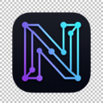

<div align="right">
  <a href="README.md"></a>
  <a href="README-vi.md"></a>
</div>

<div align="center">
  
  <h1>🧠 Neuro-Nav</h1>
  <p><strong>The Developer's Micro-OS: Context management, semantic search, and AI-powered browsing for software engineers.</strong></p>
  
  <p>
    
    
    
    
    
  </p>

  <p>
    <a href="#-introduction">Introduction</a> •
    <a href="#-core-features">Features</a> •
    <a href="#-pros--cons">Pros & Cons</a> •
    <a href="#-installation-guide">Installation</a> •
    <a href="#-usage-guide">Usage</a>
  </p>
</div>

---

## 🌟 Introduction

**Neuro-Nav** is a next-generation Chrome Extension built specifically for Software Engineers, Researchers, and Power Users — those who face information fragmentation daily, open dozens of browser tabs simultaneously, and constantly lose their working context (context switching).

Neuro-Nav transforms your browser from a mere "web surfing window" into an **Intelligent Environment (Micro-OS)**. With fully offline RAG technology, a spider-web graph mapping system, and Git-Flow style tab management, every document you read becomes a part of your "digital brain".

## 🏷️ Release Notes (v1.0.0)

The first launch version of Neuro-Nav. Includes the following completed core features:
- **Core Framework:** Smooth experience with React 18, Vite, Tailwind CSS v4, and Manifest V3 standard.
- **Git-flow Tabs:** Support for Branching (`feat/*`, `chill/*`...), Stash & Pop, and a Workspace Management system.
- **Semantic Search:** Integrated local search engine (Orama in-memory DB), indexing up to 5,000 of the most recent pages via the `Cmd+K` shortcut.
- **Graph Visualization:** Automatic 2D mapping of your browsing telemetry using D3.js.
- **P2P Sync:** Serverless sharing feature, peer-to-peer Workspace synchronization via WebRTC protocol (PeerJS).
- **Auto-Maintenance:** Background process that automatically cleans memory junk every 24 hours and extracts DOM data without lagging the main thread (using `requestIdleCallback`).

## ✨ Core Features

### 1. 🔀 Git-Flow Tabs & Smart Workspaces
Instead of managing tabs manually, group them into workflows.
* **Workspace:** Save all tabs of a project (e.g., *Next.js docs, Supabase, Github*) into a JSON Workspace format. Easy to import/export.
* **Branching:** Use `nav checkout feat/auth` to save all current tabs and switch to a completely new set of tabs in just 1 click.
* **Stash & Pop:** Screen too messy? "Stash" (hide) all tabs into temporary memory for a clean screen, and "Pop" (restore) them intact when you need them.

### 2. 🧠 The Brain: Orama Local Semantic Search
Your data stays on your machine.
* **DOM Extraction:** Extracts the core text content of articles and programming docs after 15 seconds of reading. Eliminates ads and junk menus.
* **In-Memory Search:** Stores up to 5,000 recent pages using the ultra-lightweight Orama database (< 80MB RAM).
* **Command Palette:** Press `Cmd/Ctrl + K` to open the search bar. Type "how to config RAM WSL" and Neuro-Nav will find the exact StackOverflow thread you read 2 weeks ago.

### 3. 🌐 Symbiotic Environment & P2P
* **WebRTC Peer-to-Peer:** Send entire JSON Workspaces to colleagues without routing through any intermediary servers. Ultra-fast connections even on LAN.
* **Intent Blocker:** While you are on a coding branch (`feat/*`), the extension displays a Glassmorphism warning if you accidentally type a URL leading to Facebook or Reddit.

### 4. 🕸️ Telemetry: Graph Mapping
* Visualize your entire browsing history into an interactive 2D spider-web map (D3.js). Clearly see the click streams and connections between your research resources.

---

## ⚖️ Pros & Cons

### ✅ Pros
* **100% Privacy & Offline:** All data (Vector DB, Tabs, History) is processed locally on the browser's IndexedDB. No data is sent to the Cloud.
* **Extremely High Performance:** Using React + Tailwind CSS v4, the extension bundle is only ~300KB.
* **Breakthrough UX:** Minimalist interface with a Glassmorphism vibe, dark "Tech/Neuro" design that is easy on the eyes.
* **RAM Optimization:** Features Auto-Pruning (cleans junk every 24h) and intelligent indexing limits to keep Chrome from bloating.

### ❌ Cons
* **Desktop Only:** Powerful tab management and P2P features are not available on Mobile browsers.
* **In v1.0.0 Phase:** While P2P sync works, sending very large data payloads (hundreds of MB of vectors) might freeze the local main thread.
* **No WebGPU LLM Yet:** Temporarily omitted the feature to load AI models (like Phi-3) using the GPU to keep the initial release lightweight.

---

## 💻 Supported Platforms

| Platform | Status | Notes |
| :--- | :---: | :--- |
| **Google Chrome** | ✅ Perfect | 100% feature support (from version 114+). |
| **Microsoft Edge** | ✅ Good | Runs smoothly. Latest Edge Chromium recommended. |
| **Brave** | ✅ Good | Runs well, but P2P WebRTC might be blocked by Shields (requires reconfiguration). |
| **Arc Browser** | ⚠️ Limited | `Cmd+K` shortcuts might conflict with Arc's default shortcuts. |
| **Firefox / Safari** | ❌ Unsupported | Uses Chromium-specific APIs (`chrome.debugger`, advanced `Manifest V3`). |
| **Mobile (Android/iOS)** | ❌ Unsupported | The extension is currently designed for Desktop only. |

---

## 🚀 Installation Guide

1. Clone this repository to your machine:
   ```bash
   git clone https://github.com/neuro-nav/neuro-nav.git
   cd neuro-nav/apps/extension
   ```
2. Install dependencies and build:
   ```bash
   npm install
   npm run build
   ```
3. Install on Google Chrome:
   * Open `chrome://extensions/`
   * Enable **Developer mode** in the top right corner.
   * Click **Load unpacked** and select the `apps/extension/dist/` directory.

*(Alternatively, you can download the `neuro-nav-extension.zip` file directly from the Releases page and drag-and-drop it into Chrome).*

---

## 💡 Usage Guide

1. **Launch:** Click the Neuro-Nav brain icon on the Chrome toolbar or press the shortcut `Ctrl + Shift + N` (Windows) / `Cmd + Shift + N` (Mac).
2. **Save a Working Branch:** In the **Branches** section, select the `feat/` prefix and type a task name (e.g., `login-api`), then click Create. The system will bundle the current tabs into this branch.
3. **AI Search:** Anytime while surfing the web, press `Cmd/Ctrl + K` to call the Command Palette, type a semantic keyword to rummage through the documents you've read.
4. **P2P Sharing:** Switch to the **Peers** tab, copy your `Peer ID` to send to a colleague. Enter a colleague's ID to connect directly and click *Share Workspace*.

---

## 🖥️ CLI Bridge (`nav` command)

Control your browser from the terminal. The CLI automatically starts the background daemon — no manual setup required.

### Architecture

```
Terminal (nav-cli)  ── WebSocket ──→  nav-daemon (:9500)  ←── WebSocket ──  Chrome Extension
                    ── HTTP POST ──→  nav-daemon (:9498)
```

> **All communication is local-only** (`127.0.0.1`). No data leaves your machine.

### Installation

**From source (recommended):**

```bash
# Clone the repo, then:
cd packages/nav-server && npm link
cd ../nav-cli && npm link @neuro-nav/server && npm link
```

After linking, the `nav` command is available globally in your terminal.

**From npm** *(coming soon — after publish):*

```bash
npm install -g @neuro-nav/cli
```

### Command Reference

Run `nav help` to see all available commands:

| Command | Description |
| :--- | :--- |
| `nav help` | Show all available commands |
| `nav checkout <name>` | Switch to a browser branch (shorthand) |
| `nav branch list` | List all saved branches |
| `nav branch checkout <name>` | Switch to a branch |
| `nav branch create <name>` | Create and activate a new branch |
| `nav branch delete <id>` | Delete a branch by ID |
| `nav workspace list` | List all saved workspaces |
| `nav stash` | Stash current tabs to temporary memory |
| `nav stash pop` | Restore the most recent stash |
| `nav stash list` | List all stash entries |
| `nav search <query>` | Semantic search across indexed pages |
| `nav status` | Check daemon & extension connection health |
| `nav ping` | Quick connection test |

### Examples

```bash
# Switch browser context to a feature branch
nav checkout feat/auth-system

# Save current tabs and start fresh
nav stash
nav branch create feat/new-api

# Search for a page you read last week
nav search "kubernetes helm values"

# Check if everything is connected
nav status
# → Daemon:    ● Running
# → Extension: ● Connected
```

### Environment Variables

| Variable | Default | Description |
| :--- | :--- | :--- |
| `NAV_SERVER` | `ws://127.0.0.1:9500` | WebSocket URL for nav-daemon |
| `NAV_HTTP` | `http://127.0.0.1:9498` | HTTP URL for nav-daemon |

### How It Works

1. You run `nav checkout feat/auth` in your terminal.
2. The CLI tries to connect to the WebSocket daemon. If the daemon isn't running, the CLI **automatically spawns it** in the background.
3. The daemon relays the command to the Chrome Extension's Service Worker.
4. The extension saves your current tabs, opens the branch's saved tabs, and sends a success response back through the same channel.
5. The daemon auto-shuts down after **10 minutes** of inactivity to save resources.

---

<div align="center">
  <sub>Designed with 💜 for the builders of tomorrow.</sub>
</div>
